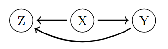

#### Trình bày một số ý chính về BN: sơ lược khái niệm, cách khai thác một mô hình, ví dụ đơn giản để thấy,...

A Directed Graphical Model (often called a Bayesian Network) consists of a joint probability distribution and a directed acyclic graph (DAG), such that the joint distribution can be factorized according to the structure of the DAG. For example, if we have the DAG:

  

Then the joint probability distribution factorizes as: $p(x,y,z)=p(x)p(y|x)p(z|x,y)$. That is, the joint probability distribution is factorized into the product of conditional probability distributions. Specifically, for each variable at the end of an arrow (i.e., a child node), its distribution is conditioned on the variables at the start of the arrows pointing to it (i.e., its parents). For any variable with no incoming arrows (i.e., no parents), its distribution appears as a marginal distribution. 

Directed Graphical Models are useful for reasoning, decision-making, and prediction tasks. In this project, I will select a directed graphical model from a dataset to analyze relationships, extract meaningful insights, and make predictions.

