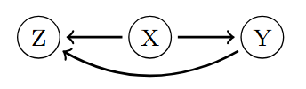

# Project Summary
### Introduction

The dataset used in this project is integrated within the `LinRegInteractive` (`R` package). Use codes below to:

1. **See the dataset description**:


```{r}
install.packages("LinRegInteractive")
library(LinRegInteractive)
data(munichrent03)
?munichrent03
```
Sample of 2,053 appartments from the data collected for the preparation of the Munich rent index 2003. A data frame with 2,053 observations on the following 12 variables:
- `rent`: Net rent in EUR (numeric).
- `rentsqm`: Net rent per square meter in EUR (numeric).
- `area`: Floor area in square meters (numeric).
- `rooms`: Number of rooms (numeric).
- `yearc`: Year of construction (numeric).
- `bathextra`: High quality equipment in the bathroom? (Factor)
- `bathtile` : Bathroom tiled?(Factor)
- `cheating` : Central heating available? (Factor)
- `district`: Urban district where the apartment is located. (Factor with 25 levels)
- `location`: Quality of location. Ordered factor with levels "normal", "good" and "top".
- `upkitchen`: Upscale equipment in kitchen? (Factor)
- `wwater` : Hot water supply available? (Factor)

Source: [https://data.ub.uni-muenchen.de/2/](https://data.ub.uni-muenchen.de/2/), for more details see the [Package description](https://cran.r-project.org/web/packages/LinRegInteractive/LinRegInteractive.pdf) (page 26).

2. **Export the dataset as a csv file**:

```{r}
write.csv(munichrent03,file="munichrent03.csv")
```

--- 

From the description of this dataset, we can come up with several business questions, such as: 

- What factors (direct or indirect) influence the rent? Which district has the highest rental prices?
- If a house is equipped with premium amenities, what price segment is it most likely to belong to? and so on. 

$$ 
\int_{1}^{\infty}
$$

These business questions can be addressed through common data analysis methods, including data exploration, descriptive statistics, and visual tools that reveal patterns and relationships. 

A Directed Graphical Model, on the other hand, can help us explore conditional independence relationships between variables. For example, we may want to know whether the number of rooms in a house is related to its rental price when the living area is already known. Beyond that, if we have questions that involve certain known conditions, the model allows us to compute conditional probabilities to answer them. This process is known as querying the model.

A Directed Graphical Model (often called a Bayesian Network) consists of a joint probability distribution and a directed acyclic graph (DAG), such that the joint distribution can be factorized according to the structure of the DAG. For example, if we have the DAG:
<p align="center">
  
</p>

Then the joint probability distribution factorizes as: `p(x,y,z)=p(x)p(y|x)p(z|x,y)`. That is, the joint probability distribution is factorized into the product of conditional probability distributions. Specifically, for each variable at the end of an arrow (i.e., a child node), its distribution is conditioned on the variables at the start of the arrows pointing to it (i.e., its parents). For any variable with no incoming arrows (i.e., no parents), its distribution appears as a marginal distribution. 

Directed Graphical Models are useful for reasoning, decision-making, and prediction tasks. In this project, I will select a directed graphical model from a dataset to analyze relationships, extract meaningful insights, and make predictions.

---

### Tasks:
| Description | Tools|
|--|--|
|Export data from `R`| `R`|
|Data Exploration | `Python`|

---

### Key takeaways
Trả lời các câu hỏi đã được đặt ra. Rút ra các insights thêm nếu có. Trích dẫn đến các file code để thấy rõ hơn.
